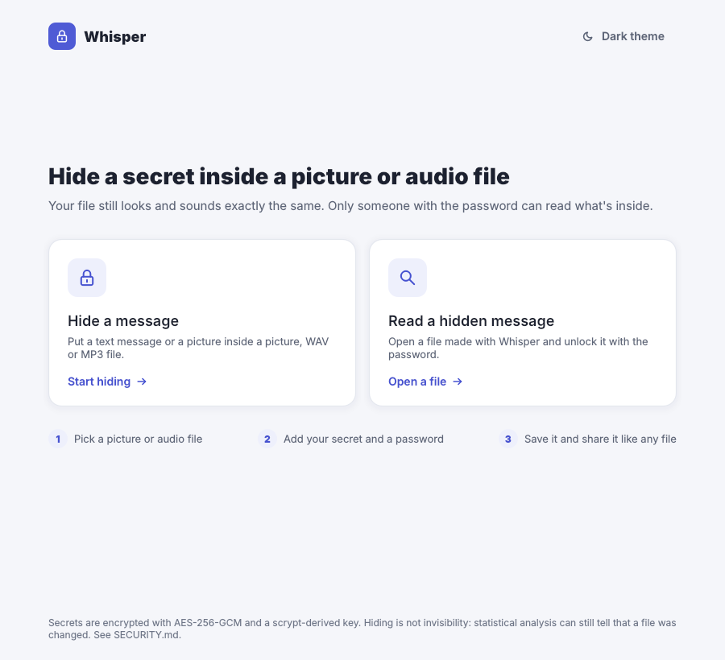
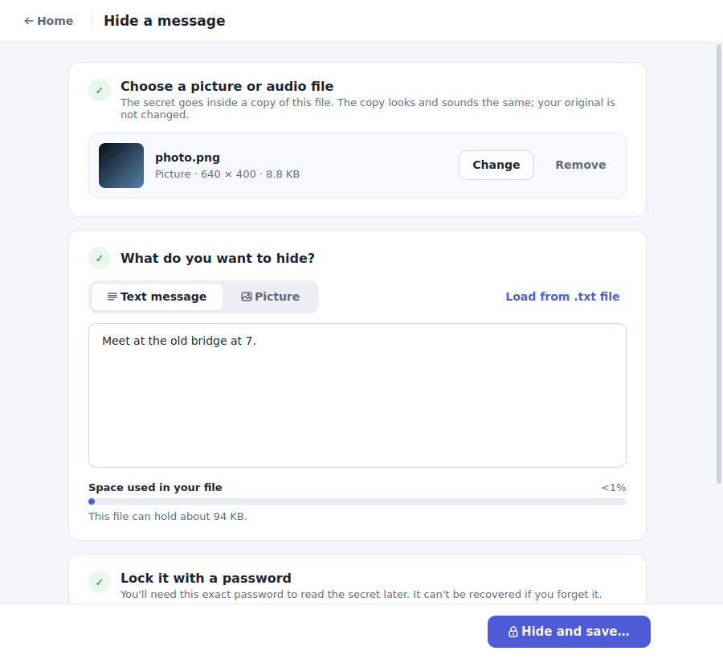
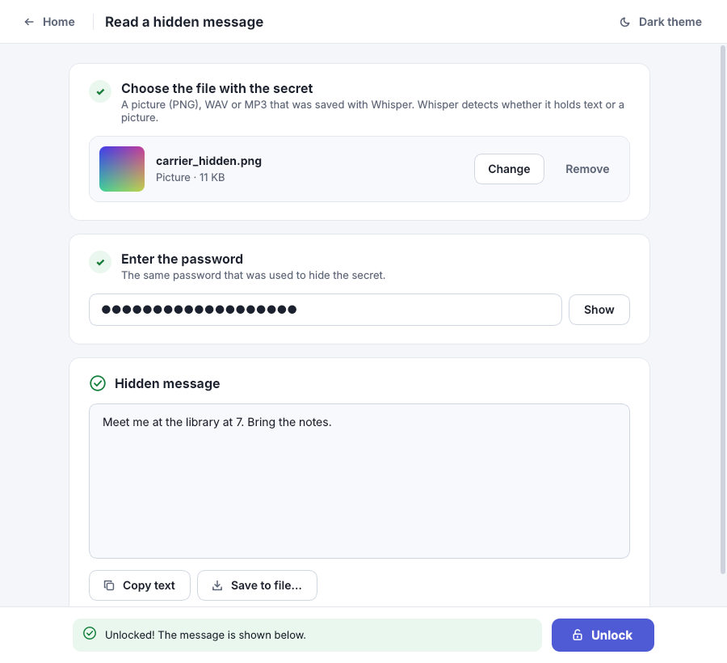

# Whisper

Hide an encrypted text message or picture inside an ordinary picture or audio file.
The result looks and sounds the same as the original; only someone with the password
can read what is inside.



## Features

- Hide **text** or a **picture** inside a **picture** (PNG, BMP, TIFF, JPG, WebP → saved as PNG), a **WAV** (8/16-bit PCM) or an **MP3**.
- The type of secret is detected automatically when you read it back.
- **AES-256-GCM** encryption, key derived from the password with **scrypt**; tampering is detected.
- No markers in the file: without the password a Whisper file is indistinguishable from one with nothing hidden (pictures and WAV).
- Password strength meter and a strong-password generator.
- Desktop app (PyQt5) and a command-line tool.
- Files made by the old Whisper v1 can still be opened (read-only).

Details and limits: [SECURITY.md](SECURITY.md).

## Quick start (Windows)

1. Install Python 3.10+ from <https://www.python.org/downloads/> (tick *Add python.exe to PATH*).
2. Double-click **`setup.bat`** — it creates `.venv` and installs everything from `requirements.txt`.
3. Double-click **`run.bat`** to start the app.

**PyCharm:** *Settings → Project → Python Interpreter → Add Interpreter → Existing* →
`<project>\.venv\Scripts\python.exe`, then run `app.py`.

### Any OS, manually

```bash
python -m venv .venv
# Windows: .venv\Scripts\activate      macOS/Linux: source .venv/bin/activate
pip install -r requirements.txt
python app.py
```

## Command line

The password is asked for interactively (or taken from `WHISPER_PASSWORD`).

```bash
python Whisper/main.py hide-text  photo.png  photo_secret.png  -m "meet at 7"
python Whisper/main.py hide-text  song.wav   song_secret.wav   -f message.txt
python Whisper/main.py hide-image photo.png  photo_secret.png  secret.jpg
python Whisper/main.py reveal     photo_secret.png  [-o out.txt]
python Whisper/main.py capacity   photo.png
```

## Tests

```bash
pip install -r requirements-dev.txt
pytest
```

The suite covers round-trips for every carrier, wrong passwords, tampering,
capacity limits, absence of plaintext markers, v1 compatibility, the CLI and a GUI smoke test.

## Project structure

```
app.py                     start the desktop app
Whisper/
  engine.py                crypto + steganography (the only module the UI talks to)
  legacy.py                read-only support for Whisper v1 files
  main.py                  command-line interface
gui/
  theme.py                 colours, stylesheet, icons, shared widgets
  StartWindow/mainWindow.py   main window and home screen
  HideMessage/hideMessage.py  "Hide a message" page
  RevealContent/revealContent.py  "Read a hidden message" page
tests/                     pytest suite and v1 fixtures
docs/screenshots/
setup.bat, run.bat         Windows helpers
```

## Screenshots

| Hide | Read |
|---|---|
|  |  |


